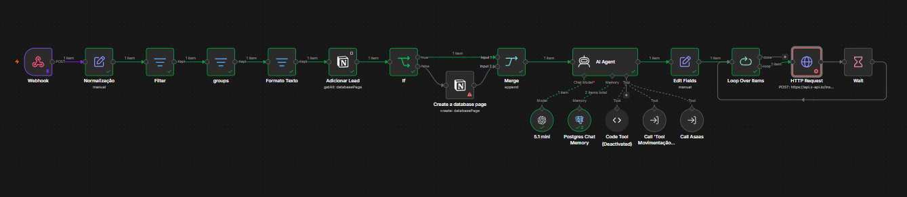
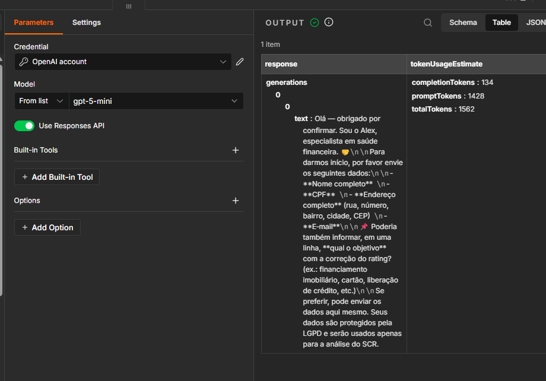
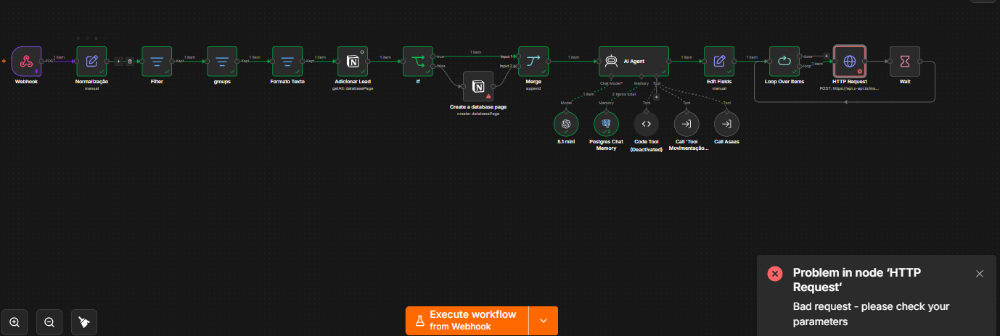

# 🤖 Agent AI & Lead Management Automation System (n8n)

> Sistema completo e automatizado de atendimento, qualificação de leads, integração com CRM (Notion), memória conversacional (PostgreSQL) e ações financeiras/notificações via WhatsApp (Z-API & Asaas).

---

## 📌 Visão Geral do Arquitetura

Esta automação foi desenvolvida no **n8n** para criar um fluxo contínuo e inteligente de atendimento e gestão de leads, utilizando um **AI Agent (OpenAI GPT)** capaz de consultar banco de dados, acionar gatilhos financeiros e registrar informações em CRM.

### Fluxo Completo do Sistema:

[ Webhook (Entrada) ] ➔ [ Tratamento & Normalização ] ➔ [ CRM Notion (Check/Create) ]
│
▼
[ AI Agent (GPT-4o Mini + Memória PostgreSQL) ] ➔ [ Tools: Asaas / Movimentação ]
│
▼
[ Formatação de Saída ] ➔ [ Loop & Delay ] ➔ [ Envio WhatsApp via Z-API ]

---

## 📌 Visão Geral do Fluxo

---

## 🤖 Processamento e Saída do AI Agent

---

## 🛠️ Arquitetura e Monitoramento de Integrações

---

### 💡 Nota sobre a Execução do Envio (Z-API)

Nos prints de execução do fluxo, o nó final **HTTP Request (Z-API)** apresenta um aviso de erro temporário (`400 Bad Request`). Isso ocorre exclusivamente devido à suspensão de saldo/cota na instância de testes utilizada no gateway do WhatsApp durante a geração da documentação.

**Comportamento em Produção:**
* A lógica de negócio, extração de intenção via LLM e armazenamento em banco (PostgreSQL) completam 100% da execução com sucesso.
* Com uma chave/instância ativa na Z-API, a payload já formatada pelo nó `Edit Fields` é disparada instantaneamente ao número cadastrado.

## 🚀 Principais Funcionalidades

* 📥 **Recepção de Webhooks:** Captura automática de dados e mensagens em tempo real.
* 🧹 **Tratamento & Normalização de Dados:** Sanitização de textos, filtros e agrupamento de variáveis antes do processamento.
* 📊 **Gestão de CRM (Notion Integration):**
  * Busca e verificação da existência prévia do lead na base.
  * Criação automática de novas páginas/cards de leads caso não existam (`If/Merge logic`).
* 🧠 **Agente de Inteligência Artificial Avançado (AI Agent):**
  * **Modelo LLM:** OpenAI (GPT-4o mini).
  * **Memória Persistente:** `Postgres Chat Memory` para manter o histórico e contexto das conversas de cada usuário.
  * **Tools / Ferramentas Customizadas:**
    * Integração com **Asaas** (geração/consulta de cobranças).
    * Ferramentas de movimentação de etapas/status.
* 💬 **Disparo Inteligente de Mensagens:**
  * Processamento em lote com `Loop Over Items`.
  * Requisições HTTP conectadas à **Z-API** para envio direto no WhatsApp.
  * Controle de cadência e *rate limit* utilizando o nó `Wait`.

---

## 🛠️ Tecnologias e Serviços Utilizados

| Componente | Tecnologia / Serviço | Função no Projeto |
| :--- | :--- | :--- |
| **Orquestrador** | n8n | Automação e fluxo de trabalho |
| **LLM Engine** | OpenAI (GPT-4o mini) | Cérebro da IA para processamento de linguagem natural |
| **Database / Memory** | PostgreSQL | Armazenamento do histórico da conversa (`Postgres Chat Memory`) |
| **CRM Database** | Notion API | Registro e consulta de contatos e leads |
| **WhatsApp Gateway**| Z-API (via HTTP Request) | Envio de mensagens automatizadas para o cliente |
| **Gateway Financeiro**| Asaas API (via Sub-workflow/Tool)| Gestão e acionamento de dados de cobrança |

---

## 🔍 Detalhamento das Etapas do Workflow

### 1. Ingestão e Preparação de Dados (Pipeline Inicial)
1. **Webhook:** Recebe os payloads da mensagem ou formulário de entrada.
2. **Normalização & Formato Texto:** Padroniza caracteres, limpa espaços e prepara os campos necessários.
3. **Filter & Groups:** Filtra mensagens irrelevantes ou duplicadas.
4. **Notion Check & Create:** Valida se o lead já possui cadastro. Se for um novo contato, cria a entrada no CRM automaticamente.

### 2. Processamento com AI Agent
* O nó **AI Agent** recebe a solicitação normalizada e consulta o histórico do usuário no **PostgreSQL**.
* Dependendo da intenção do usuário, a IA aciona autonomamente as **Tools** configuradas (ex: chamar API do Asaas para consultar ou gerar dados financeiros).

### 3. Distribuição & Envio de Respostas
* O texto retornado pela IA passa pelo nó **Edit Fields** para formatação da resposta.
* O fluxo entra em um nó de **Loop Over Items** para garanitir a entrega correta de mensagens sequenciais.
* É feita uma chamada **HTTP Request** para os servidores da **Z-API** efetuando o disparo via WhatsApp.
* O nó **Wait** garante um intervalo natural entre envios para evitar bloqueios no WhatsApp.

---
